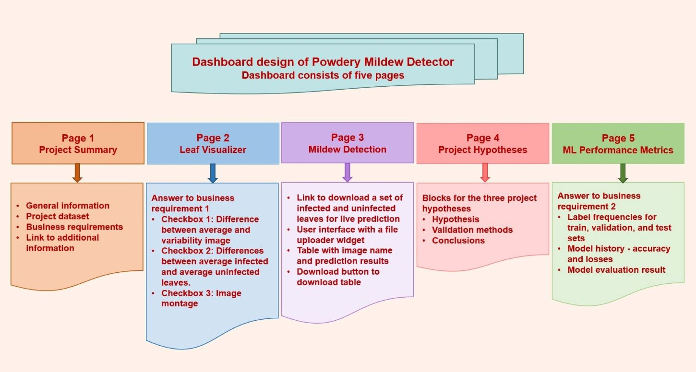
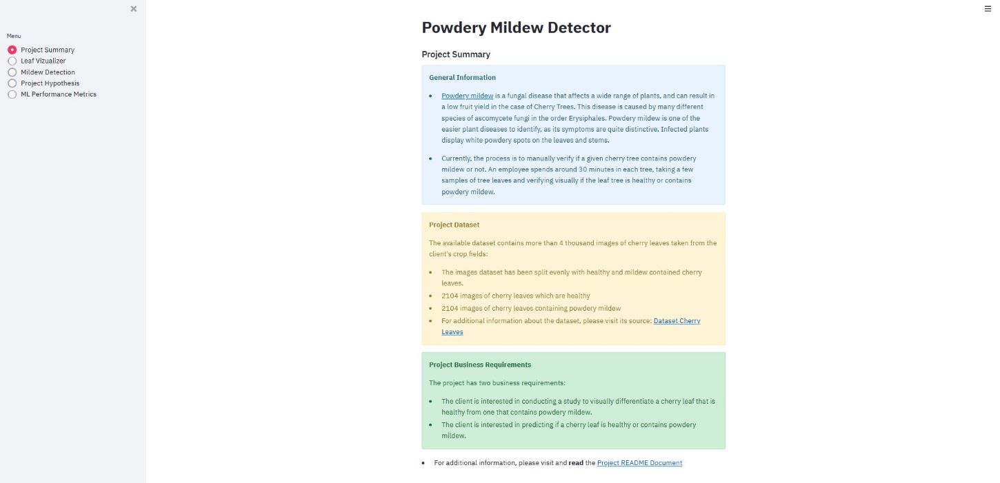
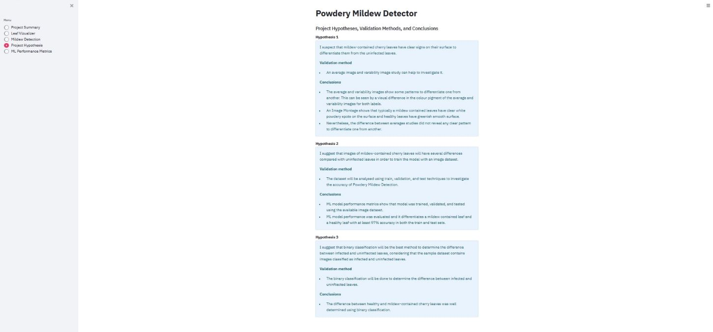

# Powdery Mildew Detection

## Powdery Mildew Detection in Cherry Leaves
Powdery Mildew Detection in Cherry Leaves is a study showing how to visually differentiate a cherry leaf that is healthy from one that contains powdery mildew, and also the capability to predict if a cherry leaf is healthy or contains powdery mildew. [Powdery mildew](https://en.wikipedia.org/wiki/Powdery_mildew) is a fungal disease that affects a wide range of plants, and is caused by many different species of ascomycete fungi in the order Erysiphales. Powdery mildew is one of the easier plant diseases to identify, as its symptoms are quite distinctive. Infected plants display white powdery spots on the leaves and stems.

## Powdery Mildew Detector 
Powdery Mildew Detector is an app that can predict based on an image of a cherry leaf, whether it is healthy or infected with powdery mildew. This app is designed based on a supervised, single-label, binary classification machine learning model. Binary classifier is used to predict the outcome.

    

## [View live website](https://project-5-image-identification-4f5afac6ab95.herokuapp.com/)

---
## Table of contents
- [Powdery Mildew Detection](#powdery-mildew-detection)
  - [Powdery Mildew Detection in Cherry Leaves](#powdery-mildew-detection-in-cherry-leaves)
  - [Powdery Mildew Detector](#powdery-mildew-detector)
  - [Dataset Content](#dataset-content)
  - [Business Requirements](#business-requirements)
  - [Hypotheses and Validation Methods](#hypotheses-and-validation-methods)
  - [The Rationale to Map the Business Requirements](#the-rationale-to-map-the-business-requirements)
  - [ML Business Case](#ml-business-case)
  - [Goals and User Stories](#goals-and-user-stories)
  - [Dashboard Design](#dashboard-design)
    - [Project Summary](#project-summary)
    - [Leaf Visualizer](#leaf-visualizer)
    - [Mildew Detection](#mildew-detection)
    - [Project Hypotheses](#project-hypotheses)
    - [ML Performance Metrics](#ml-performance-metrics)
- [Issues Found During App Development and Deployment](#issues-found-during-site-development-and-deployment)
- [Unfixed Bugs](#unfixed-bugs)
- [Deployment](#deployment)
- [Technologies Used](#technologies-used)
- [Data Analysis and Machine Learning Libraries](#data-analysis-and-machine-learning-libraries)
- [Credits](#credits)

---
## Dataset Content
The main contents of the dataset are disussed in this section.

- The dataset is taken from [Kaggle](https://www.kaggle.com/codeinstitute/cherry-leaves), and it is provided by Code Institute for the purpose of this portfolio project. I have created a fictitious user story where predictive analytics can be applied in a real project in the workplace.
- The dataset contains more than 4 thousand images taken from the client's crop fields. About 50% of the images show healthy cherry leaves and 50% of the images show the cherry leaves containing powdery mildew. Powdery mildew a fungal disease that affects many plant species. The cherry plantation crop is one of the finest products in their portfolio; therefore, the company is concerned about supplying the market with a compromised quality product.

    

    

## Business Requirements
The cherry plantation crop from Farmy & Foods is facing a challenge where their cherry plantations have been presenting powdery mildew. Currently, the process is manual verification if a given cherry tree contains powdery mildew. An employee spends around 30 minutes in each tree, taking a few samples of tree leaves and verifying visually if the leaf tree is healthy or has powdery mildew. If there is powdery mildew, the employee applies a specific compound to kill the fungus. The time spent applying this compound is 1 minute. The company has thousands of cherry trees, located on multiple farms across the country. As a result, this manual process is not scalable due to the time spent in the manual process inspection.

To save time in this process, the IT team suggested an ML system that detects instantly, using a leaf tree image, if it is healthy or has powdery mildew. A similar manual process is in place for other crops for detecting pests, and if this initiative is successful, there is a realistic chance to replicate this project for all other crops. The dataset is a collection of cherry leaf images provided by Farmy & Foods, taken from their crops.

The business requirements are: 
1 - The client is interested in conducting a study to visually differentiate a cherry leaf that is healthy from one that contains powdery mildew. 
2 - The client is interested in predicting if a cherry tree is healthy or contains powdery mildew.

## Hypotheses and Validation Methods
Project hypotheses and the methods to validate them are described below. The detailed validation process will be displayed in the dashboard. 
1- I suspect that mildew-contained cherry leaves have clear signs on their surface to differentiate them from the uninfected leaves.

- An average image and varability image study can help to investigate it.

2- I suggest that images of mildew-contained cherry leaves will have several differences compared with uninfected leaves in order to train the model with an image dataset.

- The dataset will be analysed using train, validation, and test techniques to investigate the accuracy of Powdery Mildew Detection.

3- I suggest that binary classification will be the best method to determine the difference between infected and uninftected leaves, considering that the sample dataset contains images classified as infected and uninfected leaves.

- The binary classification will be done to determine the difference between infected and uninftected leaves.
- The images will be uploaded in the dashboard to determine the difference between infected and uninftected leaves. 

## The Rationale to Map the Business Requirements
### The rationale to map the business requirements to the Data Visualisations and ML Tasks
The business requirements of Powdery Mildew Detection and a rationale to map them to the Data Visualisations and ML Tasks are provided below.

- **Business Requirement 1**: Data Visualization
  - I will display the "mean" and "standard deviation" images for infected and uninfected leaves.
  - I will display the difference between an average infected leaf and an average uninfected leaf.
  - I will display an image montage for either infected or uninfected leaves.

- **Business Requirement 2**: Classification
  - I want to predict if a given leaf is infected or not with powdery mildew.
  - I want to build a binary classifier and generate reports.

## ML Business Case
- I want a ML model to predict if a leaf is infected with powdery mildew or not, based on historical image data. It is a supervised model, a 2-class, single-label, classification model.
- My ideal outcome is to provide the Farmy foods team a faster method of determining if a plant is infected with powdery mildew or not.
- The model success metrics are:
  - Accuracy of 97% on the train set as well as on the test set.
- The model output is defined as a flag, indicating if the leaf is infected with powdery mildew or not and the associated probability of being infected or not. The Farmy foods staff will do the inspection of the leaf as usual and upload the picture to the App. The prediction is made on the fly (not in batches).
- **Heuristics:** Currently, the process is to manually verify if a given cherry tree contains powdery mildew or not. An employee spends around 30 minutes in each tree, taking a few samples of tree leaves and verifying visually if the leaf tree is healthy or has powdery mildew. Although the staff require some training to detect the occurrance of disease in detail, the image analysis, sample collection, and processing will be faster and could be performed by staff with less expertise.
- The training data to fit the model come from [Kaggle](https://www.kaggle.com/codeinstitute/cherry-leaves). This dataset contains about more than 4 thousand images.
  - Train data - target: infected or not; features: all images.

## Goals and User Stories
### As a data practitioner/app user
* As a data practitioner I must ensure that the data collected is sufficient enough so that it is fit for data analysis.
* As a data practitioner I must ensure that the data is of good quality so that there are no non-image files in the image dataset.
* As a data practitioner I must ensure that the images are of proper size so that I can easily push files to GitHub.
* As a data practitioner I must ensure that I make plots so that I can distinguish between healthy and powdery mildew contained leaves.
* As a data practitioner I must ensure that the model for both train and test sets has an accuracy of at least 97% so that I can meet the client requirements.

### As a app user
* As a app user I want a project summary page so that I can briefly view the information about the project including the dataset used and business requirements.
* As a app user I want a leaf visualization page so that I can visually differentiate a cherry leaf if it is healthy or mildew contained.
* As a app user I want to download a set of cherry leaves so that I can make live predictions.
* As a app user I want to upload multiple image files so that I can check whether the given cherry leaf is healthy or mildew contained.
* As a app user I want a table with the image name and prediction results, and a download button to download the table so that I can check whether the given cherry leaf is healthy or mildew contained and save a table for records.
* As a app user I want a page indicating project hypotheses and validation methods so that I can see the approach used to meet the business requirements.
* As a app user I want a technical page displaying model performance so that I can see the accuracy of predictions.
* As a app user I want the model or dashboard to be deployed in a user-friendly interface so that it is intuitive.

## Dashboard Design
The design of the dashboard of Powdery Mildew Detector was planned considering the goals and user stories of data practitioners and app users. The dashboard is consisted of five pages, which are provided in the flowchart.

    

## Streamlit App User Interface
The dashboard of Powdery Mildew Detector is consisted of five pages, which are detailed below.

### Project Summary
This page will provide general information about the project, dataset used for data visualization and prediction, business requirements, and link for the additional information.

- **General Information**
  - [Powdery mildew](https://en.wikipedia.org/wiki/Powdery_mildew) is a fungal disease that affects a wide range of plants, and can result in a low fruit yield in the case of Cherry Trees. This disease is caused by many different species of ascomycete fungi in the order Erysiphales. Powdery mildew is one of the easier plant diseases to identify, as its symptoms are quite distinctive. Infected plants display white powdery spots on the leaves and stems.
  - Currently, the process is to manually verify if a given cherry tree contains powdery mildew or not. An employee spends around 30 minutes in each tree, taking a few samples of tree leaves and verifying visually if the leaf tree is healthy or contains powdery mildew.
- **Project Dataset**
  - The available dataset contains more than 4 thousand images of cherry leaves taken from the client's crop fields:
  - The images dataset has been split evenly with healthy and mildew contained cherry leaves
  - 2104 images of cherry leaves which are healthy
  - 2104 images of cherry leaves containing powdery mildew
  - For additional information about the dataset, please visit its source [Dataset Cherry Leaves](https://www.kaggle.com/datasets/codeinstitute/cherry-leaves)
- **Project Business Requirements** 
  The project has two business requirements: 
  - The client is interested in conducting a study to visually differentiate a cherry leaf that is healthy from one that contains powdery mildew.
  - The client is interested in predicting if a cherry leaf is healthy or contains powdery mildew.
- **Link to Additional Information**
  - Link will be provided for the additional information about the project.

    

### Leaf Visualizer
This page will provide the details for the answer to business requirement 1- "The client is interested in conducting a study to visually differentiate a cherry leaf that is healthy from one that contains powdery mildew." 

- Checkbox 1 - Difference between average and variability image
- Checkbox 2 - Differences between average infected and average uninfected leaves.
- Checkbox 3 - Image Montage

    

    

    

    

    

### Mildew Detection
This page will provide information about business requirement 2- "The client is interested in predicting if a cherry leaf is healthy or contains powdery mildew." 

- Link to download a set of infected and uninfected leaves for live prediction.
- User Interface with a file uploader widget. The user should upload multiple leaf sample images. It will display the image and a prediction statement, indicating if the leaf is infected or not with powdery mildew and the probability associated with this statement.

    

- Table with image name and prediction results.
- Download button to download table.

    

### Project Hypotheses
This page will provide blocks for the three project hypotheses, conclusions, and methods used to validate the hypotheses.

    

### ML Performance Metrics
This page will provide the details for the answer to business requirement 2. 

    

- Label Frequencies for Train, Validation, and Test Sets
    - Train - healthy: 1472 images
    - Train - powdery_mildew: 1472 images
    - Validation - healthy: 210 images
    - Validation - powdery_mildew: 210 images
    - Test - healthy: 422 images
    - Test - powdery_mildew: 422 images

    

- Model History - Accuracy and Losses

    

- Model Evaluation Result
    - The agreed accuracy criteria for the ML model performance with the client is atleast 97% accuracy. 
    - The generalized performance of the app is 99.29%.

    

---
# Issues Found During App Development and Deployment
The following issues were found during app development and deployment 
- To deploy Powdery Mildew Detector on Heroku, the stack by default did not support the Python version used to develop the app. 
I adjusted this issue:
   * By changing the stack of my project from 22 to 20

- The slug size was also too large. 
I adjusted this issue:
   * By adding the extra large files in .slugignore file

---
# Unfixed Bugs

- There are no unfixed bugs

[Back to Table of contents](#table-of-contents)

---
# Deployment
- Powdery Mildew Detector was deployed using Code Institute's mock terminal for Heroku.

## GitHub
Codeanywhere was used as a development environment where all the changes were committed to git version control system. The push command was used in Codeanywhere to save changes into GitHub.

## Heroku
**The steps for deployment are as follows:**
1. Fork or clone this repository
2. Log in to Heroku and create an App
3. At the Deploy tab, select GitHub as the deployment method
4. Link the Heroku app to the Github repository [Project-5](https://github.com/HumaIlyas/Project-5-Mildew-detection-leaves-images-identification)
5. Select the branch to be deployed, then click Deploy Branch.
6. The deployment process should happen smoothly if all deployment files are fully functional
7. When the message appeared "Your app was successfully deployed"
8. Click on "View" to open the app

**In case of need to change to stack-20 in Heroku will be done by:**
1. In Heroku click on Account Settings (under the avatar menu) on the Heroku Dashboard.
2. Scroll down to the API Key section and click Reveal. Copy the key.
3. Back in your IDE workspace, enter the following command in the terminal: heroku login -i , and enter your email then API key that you copied when prompted.
4. Then use the command heroku stack:set heroku-20 -a <the_name_of_your_app>
5. Now deploy again in the Heroku app

## [View live website](https://project-5-image-identification-4f5afac6ab95.herokuapp.com/)

---
# Technologies used
Different technologies were used to complete the contents of Powdery Mildew Detector.

### GitHub
* As a software hosting platform to keep project in a remote location.

### Git
* As a version-control system tracking.

### Codeanywhere
* As a development hosting platform.

### Heroku
* Platform as a service offering to carry out application deployment, scaling, and management.

### Python
*  As an interpreted, interactive, and object oriented scripting language.

---
# Data Analysis and Machine Learning Libraries
Main list of the libraries used in the project of Powdery Mildew Detection and some examples of how these libraries were used is provided below.
* **Numpy:** It is a general-purpose array-processing package, adding support for large, multi-dimensional arrays and matrices, along with a large collection of high-level mathematical functions.
* **Pandas:** It is an open-source, python package used for working with data sets. It has functions for analyzing, cleaning, exploring, manipulating, and visualizing data.
* **Matplotlib:** It is a cross-platform, data visualization and graphical plotting library for python. This provides the capability to plot any data structure, while using minimum memory and cpu in any tool.
* **Seaborn:** It is Python data visualization library, which offers a built in themes for styling matplotlib graphics. It will be used to visualize random distributions. 
* **Plotly:** It is a data visualization library written in JavaScript, making graphs inherently interactive.
* **Streamlit:** It is used to create web apps for data science and machine learning.
* **Scikit-learn:** It is used to train machine learning models for classification.
* **Tensorflow:** It is an open-source machine learning platform focused on deep neural networks.
* **Keras:** It is an open-source library that provides a Python interface for artificial neural networks. It acts as an interface for the TensorFlow library.
* **Keras-tuner:** It is an easy-to-use, scalable hyperparameter optimization framework that solves the pain points of hyperparameter search.
* **Protobuf:** Protocol Buffers is a free and open-source cross-platform data format used to serialize structured data. It is useful in developing programs to communicate with each other over a network or for storing data.
* **Joblib:** It is a set of tools to provide lightweight pipelining in Python.
* **PIL:** Python Imaging Library is a free and open-source additional library for the Python programming language that adds support for opening, manipulating, and saving many different image file formats.

---
# Credits
To complete the contents of Powdery Mildew Detection: Powdery Mildew Detection in Cherry Leaves, I learned coding and collected the information from different sources.

- Learned Python coding from [Code Institute](https://learn.codeinstitute.net/)
- Used Code Institute student template [template](Code-Institute-Solutions/milestone-project-mildew-detection-in-cherry-leaves)
- Collected information on good and bad coding practices from:
  - [Documenting Python Code](https://realpython.com/documenting-python-code/)
- The description on the malaria detection in blood cells provided by the tutor of the Code Institute with [Malaria Detection](https://github.com/Code-Institute-Solutions/WalkthroughProject01) and an app [Malaria Detector](https://malaria-predictor.onrender.com/) was useful as well as an inspiration to work on the project [Powdery Mildew Detection](https://github.com/HumaIlyas/Project-5-Mildew-detection-leaves-images-identification) and design an app [Powdery Mildew Detector](https://project-5-image-identification-4f5afac6ab95.herokuapp.com/).
- The information on how to build keras tuning model for hyperparameter optimization was collected from [Tensorflow](https://www.tensorflow.org/tutorials/keras/keras_tuner) and [KerasTuner](https://keras.io/keras_tuner/)

## Content
- The cherry with leaf icon in the dashboard.py file was taken from [Cherry Emoji](https://emojicombos.com/cherry).
- The details about the powdery mildew were found at [Powdery mildew](https://en.wikipedia.org/wiki/Powdery_mildew)

## Acknowledgements
- I acknowledge all the tutors and fellow students at [Slack](https://app.slack.com/client/T0L30B202/D03PENWED0F) for their guidance and assistance to complete Powdery Mildew Detection.
- I acknowledge [Precious Ijege](https://www.linkedin.com/in/precious-ijege-908a00168/) for mentor support and finishing touches.

[Back to Table of contents](#table-of-contents)